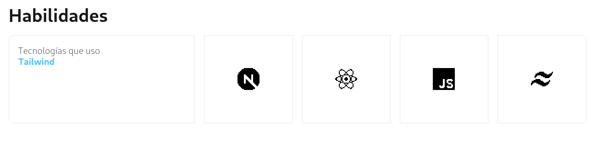
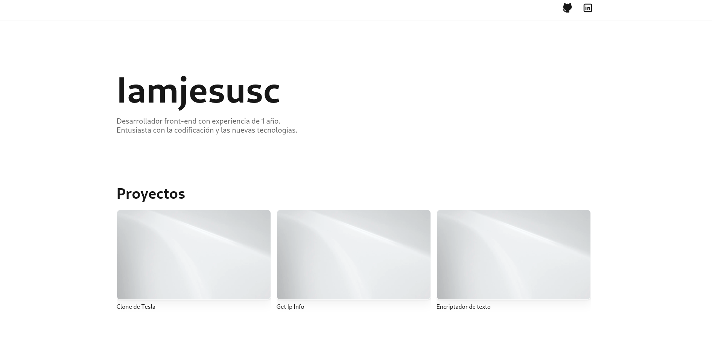
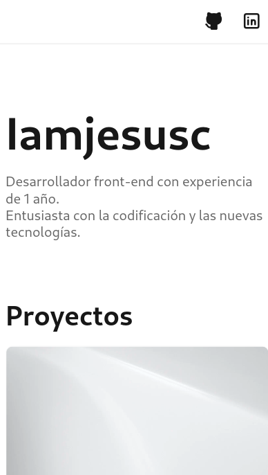

<h1 style="text-align: center;">Portfolio</h1>

[Watch live](https://repo-delta-ruddy.vercel.app/)

## Introduction

This is my personal portfolio.

## About

- [Used Technologies](#used-technologies)
- [Features](#features)
- [Development](#development)

## Used Technologies

- React
- JavaScript
- Vite
- CSS
- GitHub
- Vercel

## Features

- 📱**Full Responsive**
- 📊 **Modern UI Design**

## Development

1. **Flowchart**  
   

2. **Files structure**
   My project adheres to the file structure based on Atomic Design principles.

   - public
   - src
     - components
       - atoms
       - molecules
       - organisms
     - styles
       - global.css
     - hooks
     - utilities

3. **Bocetos**
   

   
   
   

**Process**

1. Change in the design of the skills section.
   

**Avances**

   

   
   
   

