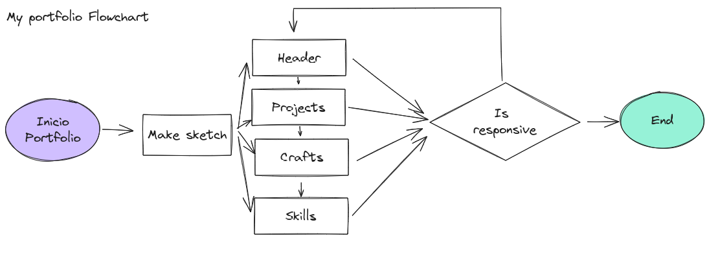
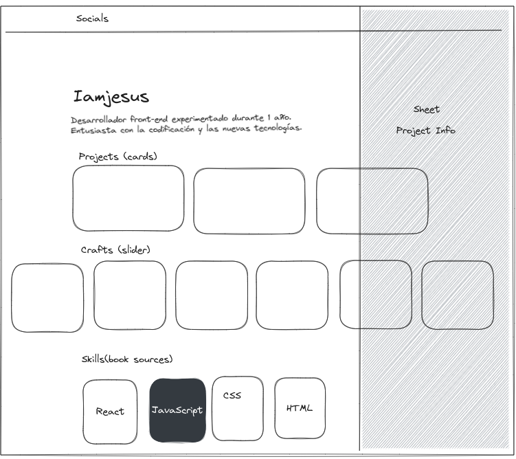
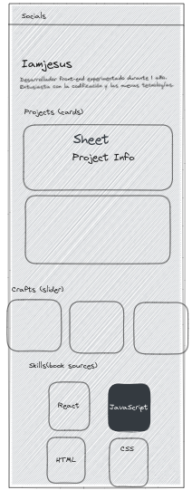

# [Portfolio](https://github.com/imjesus/portfolio)

## Preview


## About

This is my personal portfolio.

## Build

This project was built using these technologies.

- React
- Vite
- CSS
- GitHub
- Vercel

### FlowChart



### Sketch

<div style="width: 100%; display: grid; grid-template-columns: 2fr 1fr;">
  
  
</div>

## Features

📱 **Full Responsive**  
<br>
📦 **Single Page Application**  
<br>
📊 **Modern UI Design**

## Getting Started 🚀

```bash
# Clone the repository
git clone https://github.com/imjesus/portfolio
```

```bash
# Change directory
cd portfolio
```

```bash
# Install dependencies
npm install
```

```bash
# Start the development server
npm run dev
```

Runs the app in the development mode.
Open [http://localhost:3000](http://localhost:5173) to view it in the browser. The page will reload if you make edits.

## Deploy in Vercel

> [!IMPORTANT]  
> Added Vercel token to GitHub secret actions.

```bash
# Deploy
git add .
git commit -m "Update"
npm run build
git push origin main
```
